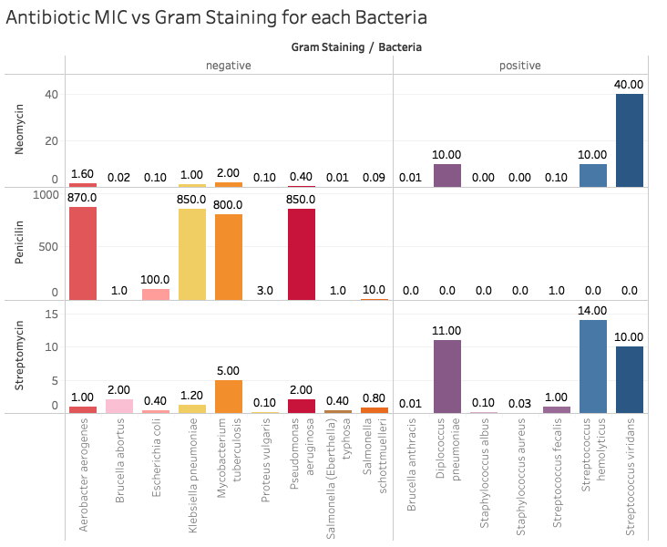

# Project 1: Visualization Design

This project tasked me to design a static visualization for a small data set and provide a rigorous rationale for my design choices. As different visualizations can emphasize different aspects of a dataset, I documented what aspects of the data I was attempting to most effectively communicate. In my rationale, I attempt to answer the questions:
1. What story (or stories) are you trying to tell? 
2. How do your visual encodings facilitate effective communication?

## About the Data
After the World War II, antibiotics were considered as "wonder drugs", since they were an easy remedy for what had been intractable ailments. To learn which drug worked most effectively for which bacterial infection, performance of the three most popular antibiotics on 16 bacteria were gathered. 

The values in the table represent the minimum inhibitory concentration (MIC), a measure of the effectiveness of the antibiotic, which represents the concentration of antibiotic required to prevent growth in vitro. The reaction of the bacteria to Gram staining is described by the covariate “gram staining”. Bacteria that are stained dark blue or violet are Gram-positive. Otherwise, they are Gram-negative.

## Write Up

This visualization shows the relationship between MIC of antibiotic and gram staining for each bacteria tested in this dataset. I have created a vertical bar chart with 2 levels, gram staining and then bacteria, and have broken down the y axis to show iterations of these measures by the 3 antibiotics tested.

The story I aim to tell answers the question “how does gram staining affect MIC of each antibiotic?” We can immediately observe a few things from this visualization: 1) there are select bacteria that have consistently higher MIC levels for all three antibiotics than others; 2) For those bacteria, we see that negative gram staining tends to have lower MIC levels for Neomycin and Streptomycin, while positive gram staining bacteria have little-to-none MIC for Penicillin.

Limitations include: number scaling for each antibiotic is relative to their own range as MIC levels vary between them, so it is difficult to compare the 3 antibiotics. To combat this, I put the antibiotic interactions to be along the y-axis so that the focus on comparison is on gram staining (where the bars align x-wise) rather than antibiotic. Next, low MIC values may have little-to-no bar showing relative to the max in the range, so it may be hard to compare levels if there is there are large outlier values of MIC. To combat this, I include detailed tooltips for each value, and Tableau allows you to see these tooltips even when hovering over where the bar would be along the line (even if the value is 0).

For color, I chose to have each bacteria a different color so that it was easier to follow along the y-axis when comparing the bacteria to all 3 antibiotics. I also made positive gram staining bacteria in a dark blue-violet color range to stay consistent with the gram staining colors in the real testing. Negative gram staining has a warm color scale to contrast the positive gram staining. There is no shape or size (width of bar) involved in this visualization. Length of the bar indicates MIC level. Gram staining is the first level of the x-axis of the chart before bacteria because I wanted to emphasize separation of positive and negative to allow easy comparison, and the contrast of color supports this feasible comparison.