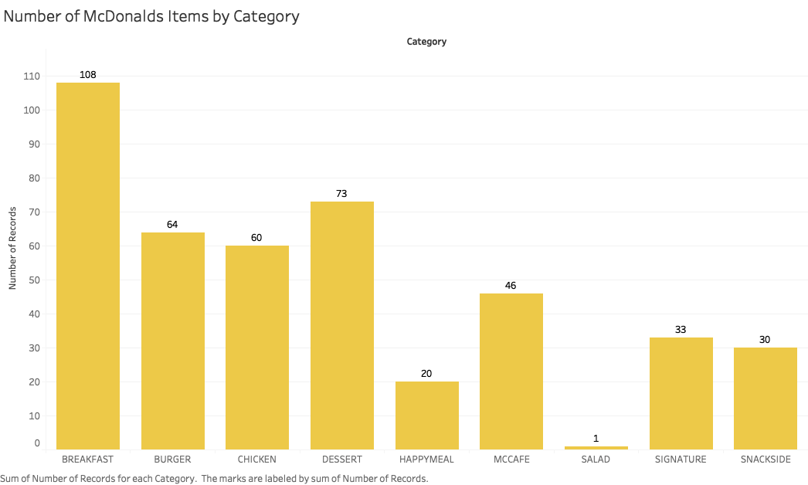
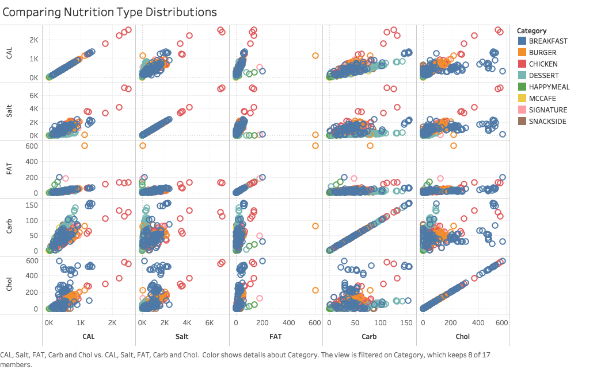
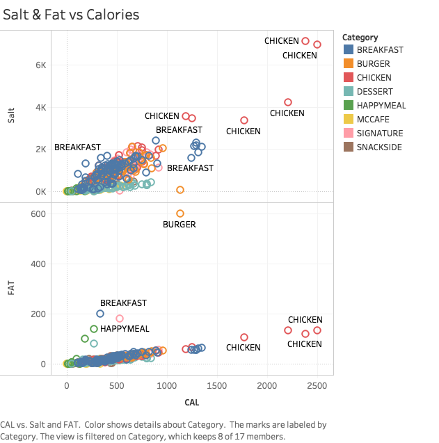
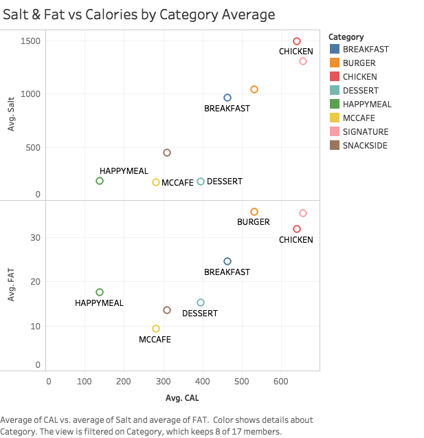
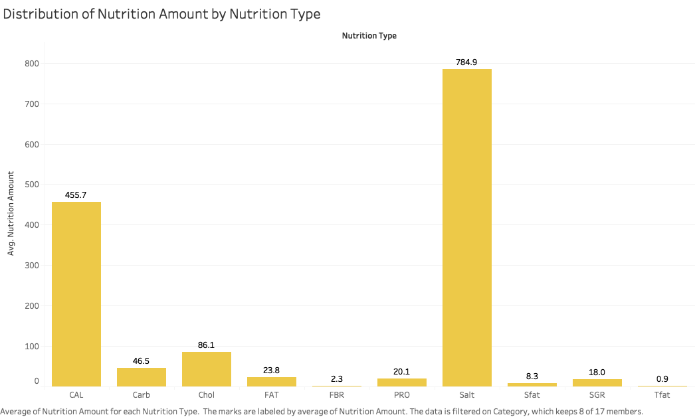
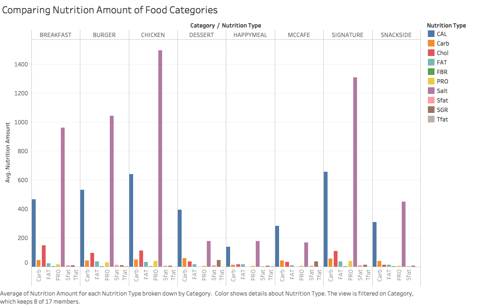
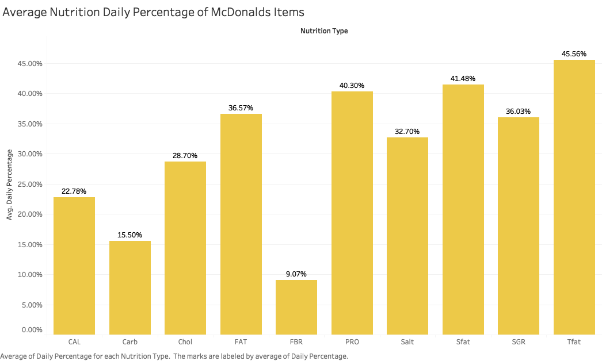
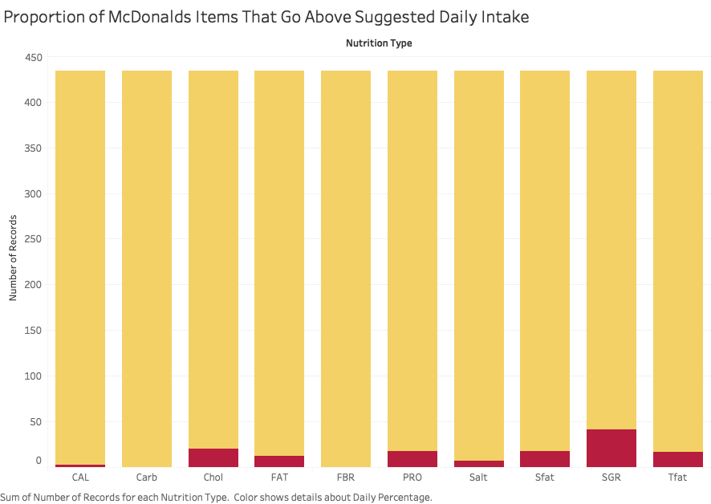
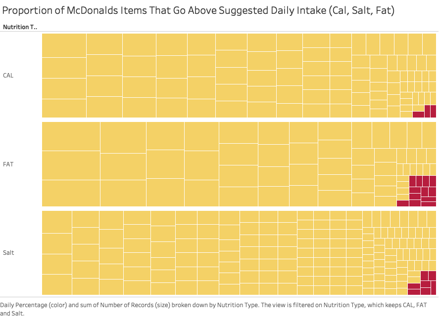
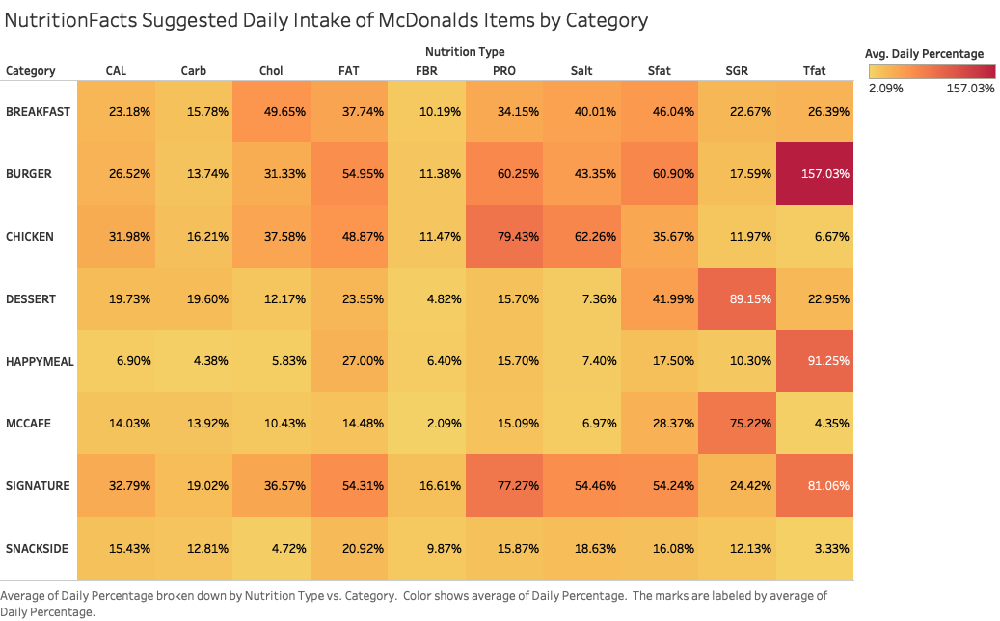

# EDA of McDonald's Nutrition Facts

## About the Data

[McDonald's NutritionFacts data source](https://github.com/pffy/data-McDonalds-nutritionfacts)

Data from this source comes from *McDonald's USA Nutrition Facts for Popular Menu Items* on the McDonald's website

McDonald's provides a nutrition analysis of their menu items to help you balance your McDonald's meal with other foods you eat. Their goal is to provide you with the information you need to make sensible decisions about balance, variety and moderation in your diet.

## Exploratory Analysis Flow

The first thing I wanted to know about this dataset was: **what kind of items does McDonald’s serve the most?** I answered this question by visualizing the total number of items for each McDonald's category. Before this, I took a look at the data to see what kinds of categories were included. Because I had some prior knowledge of McDonald's items, I decided to stick to main food categories that were of interest for comparison and excluded these:

1. ADBISCUIT
2. ADBMUFFIN
3. ALLDAYBREAKFAST
4. BEVERAGE
5. CONDIMENT
6. MCPICK2A
7. MCPICK2B
8. MCPICK2C

After looking at the category distribution, I noticed that SALAD only had 1 item in its category! I decided to look at the data source and search for the keyword “salad” to see what was up. From a portion of the table below, you can see that salads were categorized in different categories such as “CHICKEN” and/or “BREAKFAST.” We can determine from this that a limitation to the dataset is that items that perhaps belong to multiple categories won’t be represented as such. Because of this, I decided to also exclude SALAD from our analysis.

**Is there a relationship between the nutrition types by category?** There are a lot of nutrition types in the dataset, so I wanted to take a quick view of some of them on a scatterplot matrix to see what interesting variable relationships come up.

From the scatterplot matrix, you can notice that there is a lot of CHICKEN items that deviate from the rest of the categories in many of the nutrition types. CHICKEN and BREAKFAST were really making their debut in cholesterol as well. Because we were seeing quite the divide for CHICKEN in calories, salt, and fat, I wanted to take a closer look for these three nutrition types. Thus, I tried to answer the question: **what is the relationship between calories and fat & salt for the McDonald's food categories?**

As we observed before, we see multiple items from the CHICKEN category containing high volumes of calories, salt, and fat, though the difference in fat between CHICKEN and other calories isn’t as high relative to the other two. We also see one burger item as an outlier for fat, the “Double Bacon Smokehouse Burger on Artisan Roll (Fresh Beef).”

Seeing these outliers made me wonder if these items were an accurate representation of the categories, so I made the same scatterplot but aggregated it to answer the question **what is the relationship between calories and fat & salt for the McDonald's food category items on average?**

From this visualization, we can observe that CHICKEN, SIGNATURE, and BURGER appear to have a high balance of calories, salt, and fat. SIGNATURE did not have any of the outliers mentioned before, but it is the category with the highest calories and fat on average! This was an interesting discovery. Upon looking at the individual items more closely, we see that the CHICKEN outliers had higher values because of the portion size of the item. This shows to be a huge limitation to our dataset and because of varying sizes, categories like CHICKEN may not be accurately represented in terms of nutrition. I discuss more on limitations at the end of this document.

I’ve analyzed these 3 variables (calories, salt, fat) by category, but now I’m curious if the other nutrition types can tell me something. I ask a broad question again to start analyzing this: **what is the distribution of nutrition amount by nutrition type for McDonald's items?**

To be able to compare all the nutrition types together on Tableau, I had to transform the data. I pivoted all the nutrition columns into rows so that each item had a row for each nutrition type. After that, I could make aggregations comparing each nutrition type along with each category.

The unit of measure for nutrition amount varies by type; this data uses the standard unit of measure for each nutrition type (either *g* or *mg*)

I see the average g/mg values for all of the nutrition types but it doesn’t tell me much because we cannot compare the amounts of each nutrition type with different scales. To standardize this, I want to know how the nutrition values for each type compare to the daily suggested intake.

*As Specified by the FDA Based on a 2,000 Calorie Intake for Adults and Children 4 or More Years of Age.* 

Source: [GUIDE TO NUTRITION LABELING AND EDUCATION ACT (NLEA) REQUIREMENTS-ATTACHMENT 6-8](https://www.fda.gov/ICECI/Inspections/%20%20%20%20%20%20%20%20%20%20%20%20%20%20%20%20%20%20%20%20%20%20%20%20%20%20InspectionGuides/ucm114098.htm#ATTACHMENT_8)

After this transformation, I want to see how the nutrition types compare to each other now. **What is the average daily intake percentage of each nutrition type for McDonald's items?**

This looks better and represents a more accurate comparison. This visual shows us that on average, transfat is the nutrition type that has the highest ratio of value-suggested daily intake.

**What proportion of McDonald's items go above the NutritionFacts suggested daily intake?**

I wanted to get a feel for the proportion of items that go above what you need in a day for certain nutrition types. It's concerning to see that items that make up one meal can go over the amount you need daily. Even though the proportion is small, there are many items that have a high percentage in many nutrition types.

## Final

**How do the food categories of McDonald's items compare to the NutritionFacts suggested daily intake on average?**

> Average percentage of suggested daily intake for Nutrition Type vs. Category

This heatmap shows how on average a McDonald's item will compare to the NutritionFacts suggested daily intake. A percentage will show the proportion of an average item's nutrition amount vs. suggested daily intake for each nutrition type. Redder colors encode a higher percentage of daily intake. We can observe from here that transfat for burgers has the highest ratio - on average, a burger item will have 157.03% of the suggested daily intake of transfat. The lowest percentage we see is for a HappyMeal item - on average, HappyMeals will have only 4.38% of the suggested daily intake for carbs.